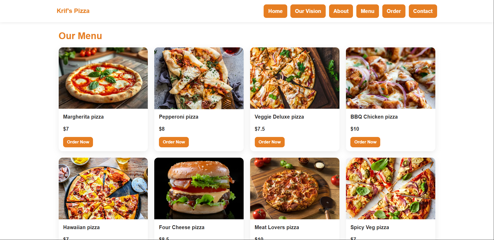

🍕 Krif's Pizza Company Website

A modern, responsive pizza website built with pure HTML, CSS, and JavaScript.
This project showcases a complete restaurant landing page with menu, ordering system, and contact section.

🚀 Features
Beautiful hero section
Fully responsive navigation bar
Interactive pizza menu
Simple order form (frontend simulation)
Smooth scrolling experience
Social media integration
Clean and modern UI design
📸 Preview

Add your website screenshot below 👇

Replace preview.png with your actual image file name

🛠️ Technologies Used
HTML5
CSS3
JavaScript(vanilla)
Font Awesome (for icons)
📂 Project Structure
📁 project-folder
 ├── index.html
 ├── images/
 └── README.md
⚙️ How to Run
Clone the repository:
git clone https://github.com/your-username/your-repo-name.git
Open the project folder
Double-click index.html or open it in your browser
🤝 Contributing

If you like this project:

⭐ Star the repo
🍴 Fork it
🛠️ Improve it and submit a pull request

Contributions are always welcome!

💡 Future Improvements
Backend integration for real orders
Payment system
User authentication
Admin dashboard
👨‍💻 Author

UWIMANA Krif
📍 Kigali, Rwanda
📧 krif014@gmail.com

📜 License

This project is open source and available under the MIT License.
